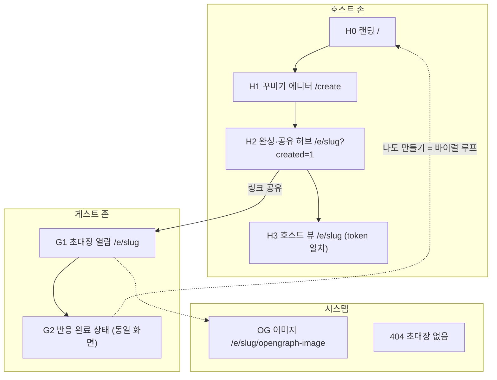

# 모디(Modi) IA — 서비스 구조 & 플로우별 화면 정의

> 호스트/게스트 역할 분리 기준으로 정보구조 재정리. 꾸미기 피벗(2026-07-12) 반영.
> 연결: [제품 PRD](모디-prd.md) · [시스템구조](모디-시스템구조.md) · (구) [화면명세](모디-화면명세.md) — 화면명세는 피벗 전 문서라 이 IA가 우선

---

## 0. 대원칙

1. **무가입 유지** — 호스트도 게스트도 계정 없음
2. **역할 구분 = 토큰** — 생성 시 브라우저에 `host_token` 저장 → 같은 URL이라도 호스트에겐 호스트 UI가 뜸 (게스트는 링크만 받으므로 토큰 없음 = 게스트 모드)
3. **화면의 무게중심**: 호스트 = **꾸미는 경험**, 게스트 = **감상하고 반응하는 경험**

---

## 1. IA 트리 (전체 구조)

---

## 2. 호스트 플로우 — "만들고 → 꾸미고 → 공유하고 → 반응 보기"

### H0. 랜딩 `/`
- **목적**: 가치 전달 + 만들기 진입
- **구성**: 헤드라인 · 예시 초대장 미리보기(무드 전달) · [초대장 만들기]
- (내 브라우저에 만든 초대장 있으면) "내가 만든 초대장" 바로가기

### H1. 꾸미기 에디터 `/create` ← 이번 주 핵심 작업
- **목적**: 10초 만에 "센스있는" 결과물. 제품의 코어 경험
- **구성** (한 화면 캔버스 + 하단 도구 탭):
  | 도구 | 내용 |
  |---|---|
  | 테마 | 프리셋 4종 (전체 무드 한 번에) |
  | 커버 | 배경 색/그라데이션 프리셋 (이미지 업로드는 P2) |
  | 문구 | 제목(필수) · 한 줄 소개 · 날짜/장소(미정 토글) |
  | 스티커 | 이모지 피커 → 초대장 위 배치 |
  | 이펙트 | 떠다니는 파티클 on/off·종류 |
- **상시 실시간 미리보기** (편집=미리보기가 같은 캔버스)
- [완성하기] → events INSERT + `host_token` 발급·저장 → H2

### H2. 완성·공유 허브 `/e/[slug]?created=1`
- **목적**: 만든 직후 공유 전환 극대화
- **구성**: 완성 초대장 풀뷰 · **카톡 카드 미리보기**(OG가 이렇게 보여요) · [초대 문구 복사] [링크 복사] · [수정하기]

### H3. 호스트 뷰 `/e/[slug]` (host_token 일치 시)
- **목적**: 반응 확인 + 재공유/수정 재진입
- **구성**: 게스트와 같은 초대장 화면 **+ 호스트 전용 요소**: 반응 현황(이모지별 카운트·누가 반응) · [수정] · [다시 공유]
- ⚠️ 대시보드 아님 — 초대장 화면에 호스트 액션만 얹는 것

---

## 3. 게스트 플로우 — "열고 → 감상하고 → 반응하고 → (재공유)"

### G1. 초대장 열람 `/e/[slug]`
- **목적**: 감상이 먼저. "오 뭐야 ㅋㅋ 예쁘다"
- **구성**:
  - **풀스크린 초대장** (커버·문구·스티커·이펙트) — 정보보다 무드 우선
  - 날짜/장소 칩 (미정 = "미정")
  - **이모지 반응 바** (🎉 ❤️ 🔥 😂 + "갈게" 태그는 선택) — 탭 한 번, 이름은 선택 입력
  - 반응한 사람들 (이모지 + 이름 있으면 이름)
- **G2. 반응 완료 상태** (같은 화면 내 전환): 내 반응 강조 · [친구한테 공유] · **[나도 만들어보기]** ← 바이럴 루프

### 시스템 화면
- **OG 이미지** `/e/[slug]/opengraph-image` — 테마 배경+제목이 박힌 카드 이미지 자동 생성 (카톡 미리보기용)
- **404** — "초대장을 찾을 수 없어요" + [만들러 가기]

---

## 4. 현재 코드와의 갭 (= 이번 주 작업 목록)

| # | 갭 | 지금 | 바꿀 것 | 크기 |
|---|---|---|---|---|
| 1 | 역할 분리 없음 | `?created=1` 배너뿐 | `events.host_token` 컬럼 + 생성 시 localStorage 저장 → H3 분기 | S (DB 1줄+분기) |
| 2 | 에디터가 그냥 폼 | 입력 폼 → 제출 | H1 캔버스형 에디터 (실시간 미리보기+도구 탭) | **L (핵심)** |
| 3 | RSVP 3버튼 | 갈게/고민중/못가+이름 필수 | 이모지 반응 바 (이름 선택) | M |
| 4 | OG 이미지 없음 | 텍스트 OG만 | opengraph-image 동적 생성 | M |
| 5 | 수정 불가 | 만들면 끝 | 호스트 [수정] → 에디터 재진입 | M |
| 6 | 명단 = RSVP 집계 | 상태별 명단 | 반응한 사람들 (소셜 증거용) | S (3과 함께) |

### 오늘 우선순위 (배포 포함)
1. Vercel 배포 (public 전환) → OG 검증 기반 확보
2. 갭 #4 OG 이미지 (배포와 함께 바로 확인)
3. 갭 #2 에디터 v1 (테마+커버 프리셋+문구+스티커 최소셋)
4. 갭 #3+#6 이모지 반응 전환
5. 갭 #1·#5 host_token·수정 — 시간 되면 (안 되면 주말)

## 5. Phase 2로 미루는 것
- 커버 **이미지 업로드** (Storage 필요) · 내 초대장 목록 `/mine` · 다른 기기에서 호스트 접근(호스트 비밀링크) · 날짜 투표·정산 등 라이프사이클
