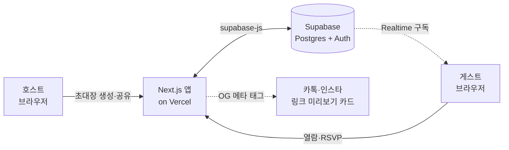
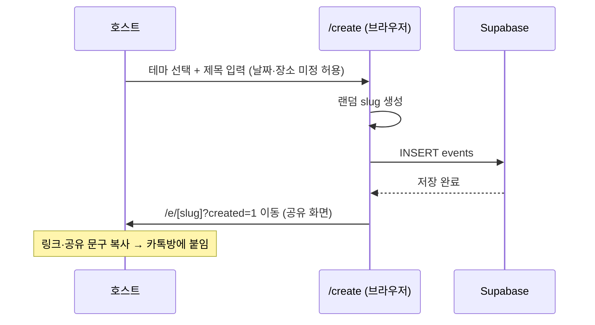
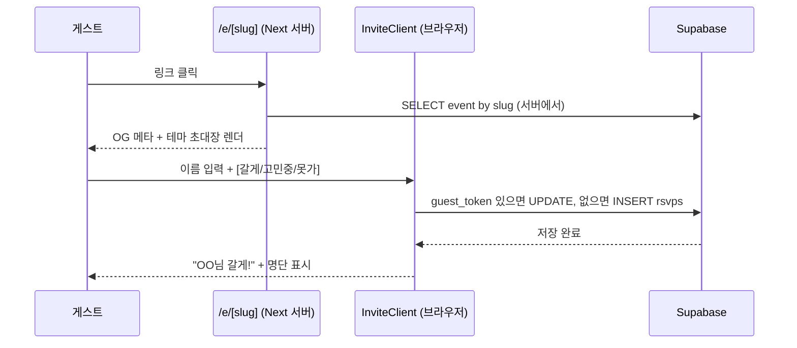
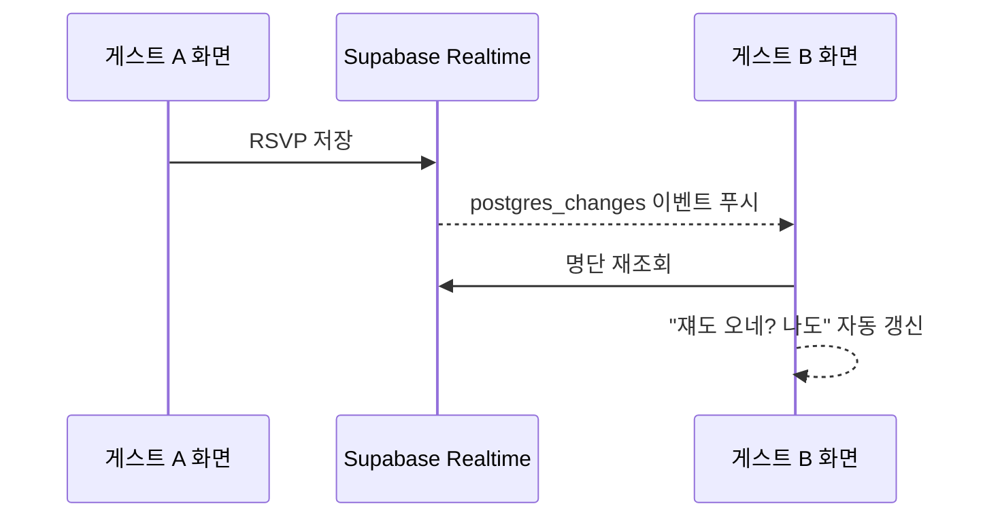
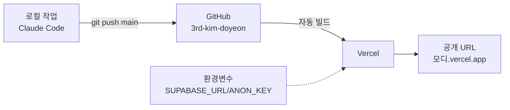

# 모디(Modi) 시스템 구조 & 데이터 흐름

> 서비스가 기술적으로 어떻게 굴러가는지 정리한 문서. (구현 기준)
> 연결: [제품 PRD](모디-prd.md) · [화면명세](모디-화면명세.md)
> 스택: Next.js 14 (App Router) · shadcn/ui · Supabase · Vercel

---

## 1. 한눈에 보는 전체 구조

- **프론트+백엔드 = Next.js 한 덩어리** (Vercel 배포). 별도 서버 없음.
- **데이터·실시간 = Supabase** 가 전부 담당 (DB + 자동 REST API + 실시간).
- **게스트는 가입·앱 없음.** 링크(브라우저)만으로 열람·응답.

---

## 2. 기술 스택 & 역할

| 영역 | 기술 | 역할 |
|------|------|------|
| 프레임워크 | **Next.js 14 (App Router)** | 페이지 렌더 + 서버 로직(OG 메타) 한 곳에서 |
| UI | **shadcn/ui + Tailwind** | 모바일 우선 컴포넌트 (Button/Card/Input/Badge/Switch) |
| 데이터 | **Supabase (Postgres)** | 이벤트·RSVP 저장. PostgREST가 테이블을 자동 REST API로 노출 |
| 실시간 | **Supabase Realtime** | RSVP 추가 시 명단 자동 갱신(스노볼) |
| 보안 | **Supabase RLS** | 익명(anon) 키로 안전하게 읽기/쓰기 (정책 기반) |
| 배포 | **Vercel** | GitHub `main` push → 자동 빌드·배포 |
| 공유 | **OG 메타 태그** | 링크 붙이면 카톡/인스타에 미리보기 카드 |

---

## 3. 데이터 모델

```mermaid
erDiagram
  events ||--o{ rsvps : "1건에 여러 응답"
  events {
    uuid id PK
    text slug "URL 주소(고유)"
    text title "제목(필수)"
    text theme "테마 키"
    timestamptz starts_at "날짜(미정=null)"
    text place "장소(미정=null)"
    text description "한 줄 소개"
    timestamptz created_at
  }
  rsvps {
    uuid id PK
    uuid event_id FK
    text guest_name "이름"
    text status "going|maybe|no"
    text guest_token "익명 식별자"
    timestamptz created_at
  }
```

- **events** = 초대장 1건. `slug`가 URL(`/e/[slug]`)이 됨.
- **rsvps** = 참석 응답 1건. `event_id`로 초대장에 연결.
- **guest_token** = 브라우저 localStorage에 저장하는 익명 ID. 가입 없이 "본인 응답 수정"을 가능하게 하는 핵심.

---

## 4. 핵심 플로우

### 4-1. 호스트 — 초대장 만들기

### 4-2. 게스트 — 열람 & RSVP

### 4-3. 실시간 명단 (스노볼)

---

## 5. 주요 기술 동작 (왜 이렇게 했나)

- **SSR + OG 메타**: `/e/[slug]`는 서버 컴포넌트라, 링크 긁힐 때 서버가 제목·이모지·소개를 OG 태그로 내보냄 → 카톡 카드가 뜸. (게스트 인터랙션 부분만 클라이언트 컴포넌트 `InviteClient`)
- **RLS(행 수준 보안)**: 익명 키를 브라우저에 노출해도, DB 정책이 "읽기/쓰기 허용 범위"를 통제. 프로토타입은 열람·응답을 열어둠.
- **Realtime 구독**: `InviteClient`가 해당 `event_id`의 `rsvps` 변경을 구독 → 누가 응답하면 명단이 새로고침 없이 갱신.
- **guest_token**: 가입 없이도 "내 응답"을 알아보게 하는 브라우저 로컬 ID. 재방문 시 수정 가능. (브라우저 바뀌면 새 응답으로 취급 = MVP 한계)
- **무마찰 원칙**: 게스트 경로에 로그인/전화번호 요구가 코드 상 아예 없음.

---

## 6. 코드 구조 매핑

| 경로 | 역할 |
|------|------|
| `app/page.tsx` | 랜딩 (정적) |
| `app/create/page.tsx` | 호스트 생성 폼 → events INSERT |
| `app/e/[slug]/page.tsx` | 서버: event 조회 + OG 메타 생성 |
| `app/e/[slug]/InviteClient.tsx` | 클라이언트: RSVP + 실시간 명단 + 공유 |
| `components/ThemeEffect.tsx` | 테마별 둥둥 이모지 이펙트 |
| `components/ui/*` | shadcn 컴포넌트 |
| `lib/supabase.ts` | Supabase 클라이언트 + 타입 |
| `lib/themes.ts` | 테마 4종 정의(색·이모지·파티클) |
| `supabase/schema.sql` | DB 스키마 + RLS + Realtime 설정 |

---

## 7. 배포 & 환경

- **환경변수 2개**: `NEXT_PUBLIC_SUPABASE_URL`, `NEXT_PUBLIC_SUPABASE_ANON_KEY` (로컬은 `.env.local`, 배포는 Vercel에 등록)
- **자동배포**: `main`에 push하면 Vercel이 다시 빌드·배포.
- (현재: 조직 비공개 레포라 Vercel 배포는 Pro Trial 필요 — 확인 중)
